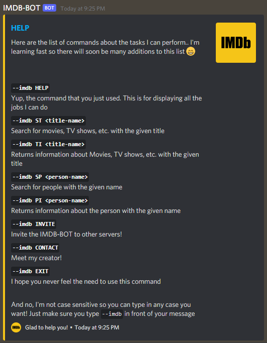

# IMDB-BOT

## Background
This is a discord bot that I made to show some data available on the <a href="https://www.imdb.com/">IMDb Website</a>. Although the information about titles are available on various websites, they often require an API Key for access to the database. In order to avoid that, I scraped the IMDb Website for the required information. This bot was made just for educational purpose and all the information scrapped belongs to their respective owners.

## How to use the BOT
Well, in my opinion, work speaks louder than words.
- Invite the bot to your server using <a href="https://discord.com/oauth2/authorize?client_id=927080106151792730&scope=bot">this link</a>.
- Just type in ` --imdb HELP ` to get this menu:

- Enjoy using this bot and if an error pops up, do let me know! or feel free to make a PR! :)